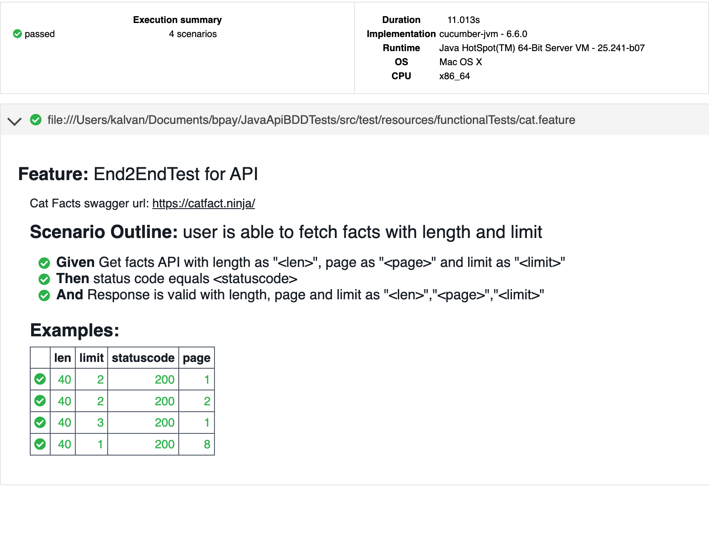

# APIBDD
API automation using Java, Cucumber, RestAssured and Junit

## PreRequisites
```
Maven will take care of all dependency management
Make sure you have
- Java
- Maven
```

## Execute
```
mvn clean install
```

## Reporting

## To Do
- [ ]  Schema validations for json response
- [ ]  DB data based validation
- [ ]  Write more utils for API validations
- [ ]  Dockerize it
- [ ]  Integrate with CI/CD pipelines
